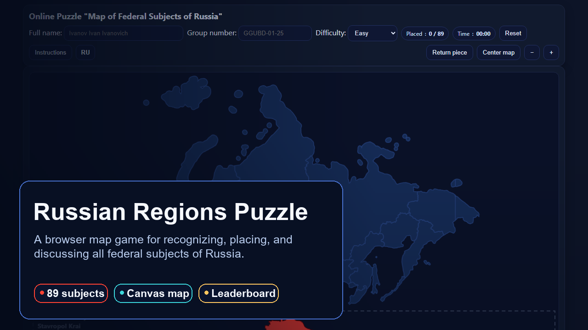
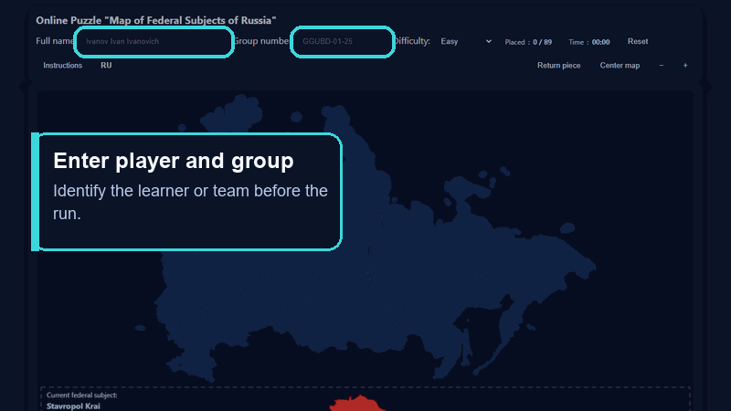
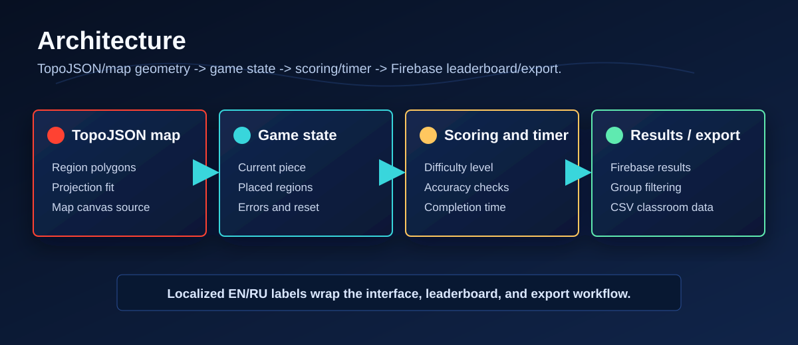
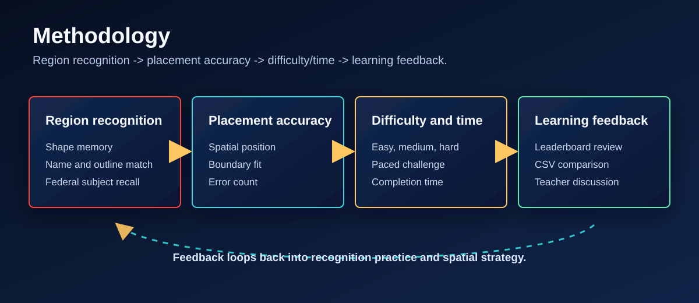
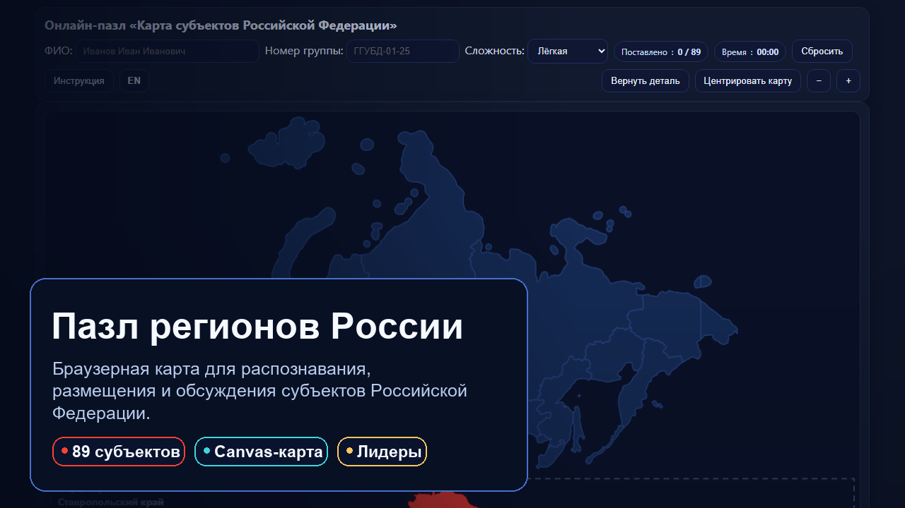
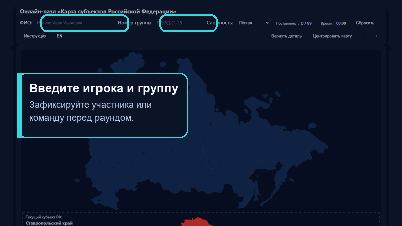
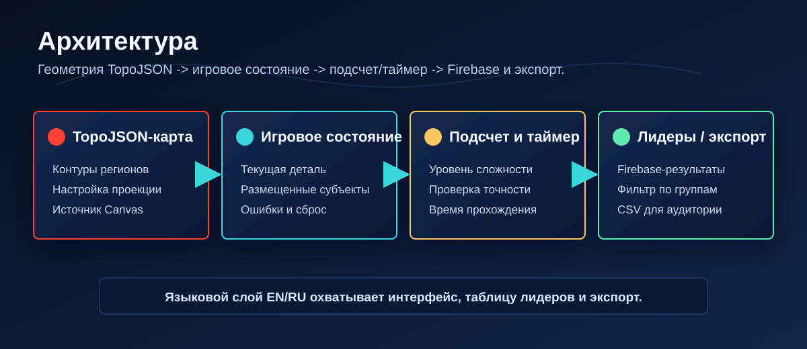
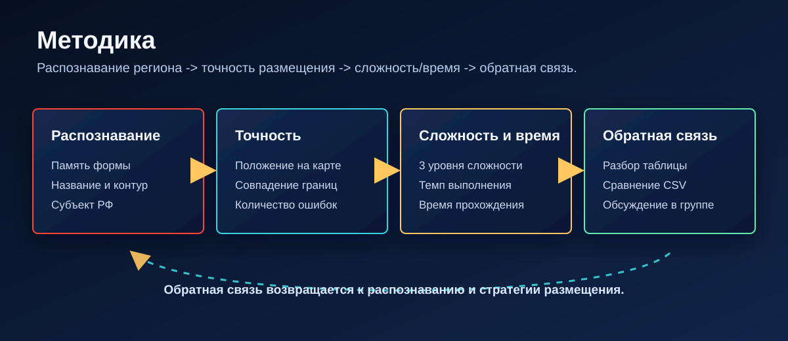

# Russian Regions Puzzle · Interactive Map Game for Learning Federal Subjects

[English](#english) · [Русский](#русский)

[](https://arseniy24rus.github.io/Russian-regions-puzzle/)
[](LICENSE)
[](LICENSE-DOCS-AND-DATA.md)

---

## English

### Overview

`Russian-regions-puzzle` is an interactive browser-based map game for learning the federal subjects of the Russian Federation. Students drag region shapes onto a map, complete the full territorial puzzle, compare results through a leaderboard and export classroom results for further analysis.

The project is designed for seminars in public administration, geography, regional studies and spatial literacy. It turns memorization of regional geography into an active task involving recognition of shapes, spatial position, territorial hierarchy and time-limited decision-making.

### Visual overview









### Live game

GitHub Pages: <https://arseniy24rus.github.io/Russian-regions-puzzle/>

### Main features

The game includes the full set of 89 Russian federal subjects, one-by-one region dragging, timer, region tray, three difficulty levels, map pan and zoom, mobile-friendly touch controls, success animation, fanfare, leaderboard, group filtering, CSV export and localStorage-based convenience features. Leaderboard data can be stored in Firebase Realtime Database.

### Technology stack

```text
HTML5 Canvas              Map rendering and interaction layer
D3 geometry/projection    Geographic calculations
TopoJSON                  Compact region geometry
Firebase Realtime DB      Optional leaderboard storage
CSV export                Classroom result analysis
GitHub Pages              Static deployment
```

### Repository structure

```text
index.html                         Main game application
Russian_regions_TopoJSON.topojson  Geometry of Russian federal subjects
screenshot-map.png                 Screenshot for documentation and preview
.nojekyll                          GitHub Pages service file
README.md                          Project documentation
```

### Local launch

```bash
python -m http.server 8000
```

Then open <http://localhost:8000/>. Internet access may be required for CDN libraries and Firebase features depending on the deployment version.

### Firebase and classroom data

If Firebase is enabled, the game can save player name, group, difficulty level, time, number of errors and completion result. This makes the tool useful not only as a game but also as a classroom data source: instructors can compare group performance, export results to CSV and discuss regional geography learning outcomes.

### Educational scenario

A typical classroom workflow consists of four stages: short introduction to the map and difficulty levels; individual or team play; export and comparison of results; group discussion of which regions were most difficult and why. The game can be used to connect spatial knowledge with administrative-territorial structure, federal districts, regional policy and demographic geography.

### Research methodology

For learning design, TopoJSON assumptions, scoring, timer, difficulty, leaderboard logic, Firebase/export considerations, assessment limits and adaptation notes, see [docs/methodology.md](docs/methodology.md).

### Interpretation and limitations

The game is an educational tool. Its purpose is not to test political views or formal cartographic expertise, but to improve spatial recognition and familiarity with Russian regions. The geometry file, map projection and region names should be periodically checked for consistency with the intended teaching context.

### Citation

If you use the game in teaching, research, presentations or derivative educational materials, please cite:

> Sitkovskiy, A. M. (2026). Russian Regions Puzzle: interactive map game for learning federal subjects. GitHub. https://github.com/Arseniy24RUS/Russian-regions-puzzle

### License

| Material | License | Notes |
| --- | --- | --- |
| Source code | [MIT](LICENSE) | Static game code, tests and scripts. |
| Repository-authored docs, data and educational content | [CC BY 4.0](LICENSE-DOCS-AND-DATA.md) | Includes methodology, documentation, diagrams, screenshots and classroom text unless otherwise noted. |
| Third-party libraries, Firebase services, map-data sources, official or institutional names and external materials | Original terms | See [THIRD_PARTY_NOTICES.md](THIRD_PARTY_NOTICES.md); project licenses do not override third-party terms. |

---

## Русский

### Обзор

`Russian-regions-puzzle` — интерактивная браузерная картографическая игра для изучения субъектов Российской Федерации. Студенты перетаскивают контуры регионов на карту, собирают полную территориальную мозаику, сравнивают результаты через таблицу лидеров и экспортируют итоги аудиторной работы для дальнейшего анализа.

Проект предназначен для семинаров по государственному управлению, географии, регионоведению и пространственной грамотности. Он превращает запоминание региональной географии в активную задачу, включающую распознавание формы, пространственного положения, территориальной иерархии и принятия решений в условиях ограничения времени.

### Визуальный обзор









### Публичная игра

GitHub Pages: <https://arseniy24rus.github.io/Russian-regions-puzzle/>

### Основные возможности

Игра включает полный набор из 89 субъектов РФ, перетаскивание регионов по одному, таймер, лоток регионов, три уровня сложности, перемещение и масштабирование карты, сенсорное управление для мобильных устройств, анимацию успеха, фанфары, таблицу лидеров, фильтрацию по группе, экспорт CSV и удобные функции на основе localStorage. Данные таблицы лидеров могут сохраняться в Firebase Realtime Database.

### Технологический стек

```text
HTML5 Canvas              Отрисовка карты и интерактивный слой
D3 geometry/projection    Географические расчёты
TopoJSON                  Компактная геометрия регионов
Firebase Realtime DB      Опциональное хранение таблицы лидеров
CSV export                Анализ результатов аудиторной работы
GitHub Pages              Статическая публикация
```

### Структура репозитория

```text
index.html                         Основное игровое приложение
Russian_regions_TopoJSON.topojson  Геометрия субъектов РФ
screenshot-map.png                 Скриншот для документации и превью
.nojekyll                          Служебный файл GitHub Pages
README.md                          Документация проекта
```

### Локальный запуск

```bash
python -m http.server 8000
```

Затем откройте <http://localhost:8000/>. В зависимости от версии развёртывания интернет-доступ может потребоваться для CDN-библиотек и функций Firebase.

### Firebase и аудиторные данные

Если Firebase включён, игра может сохранять имя игрока, группу, уровень сложности, время, число ошибок и факт завершения. Это делает инструмент не только игрой, но и источником данных для учебной аудитории: преподаватель может сравнивать результаты групп, экспортировать CSV и обсуждать итоги освоения региональной географии.

### Учебный сценарий

Типовой аудиторный процесс состоит из четырёх этапов: краткое введение в карту и уровни сложности; индивидуальная или командная игра; экспорт и сравнение результатов; групповая дискуссия о том, какие регионы оказались наиболее сложными и почему. Игру можно использовать для связи пространственного знания с административно-территориальным устройством, федеральными округами, региональной политикой и демографической географией.

### Методология исследования

Описание учебного дизайна, предположений TopoJSON, логики подсчета, таймера, сложности, таблицы лидеров, Firebase/экспорта, ограничений оценки и адаптации см. в [docs/methodology.md](docs/methodology.md).

### Интерпретация и ограничения

Игра является образовательным инструментом. Её цель — не проверка политических взглядов или формальной картографической экспертизы, а развитие пространственного распознавания и знакомства с субъектами РФ. Файл геометрии, картографическая проекция и названия регионов должны периодически проверяться на соответствие учебному контексту.

### Как цитировать

При использовании игры в преподавании, исследовании, презентациях или производных учебных материалах, пожалуйста, цитируйте:

> Ситковский А. М. Russian Regions Puzzle: interactive map game for learning federal subjects. GitHub, 2026. https://github.com/Arseniy24RUS/Russian-regions-puzzle

### Лицензия

| Материал | Лицензия | Примечания |
| --- | --- | --- |
| Исходный код | [MIT](LICENSE) | Код статической игры, тесты и скрипты. |
| Авторские документы, данные и учебный контент репозитория | [CC BY 4.0](LICENSE-DOCS-AND-DATA.md) | Методология, документация, диаграммы, скриншоты и учебные тексты, если не указано иное. |
| Библиотеки третьих сторон, сервисы Firebase, источники картографических данных, официальные или институциональные названия и внешние материалы | Исходные условия | См. [THIRD_PARTY_NOTICES.md](THIRD_PARTY_NOTICES.md); лицензии проекта не переопределяют условия третьих сторон. |
